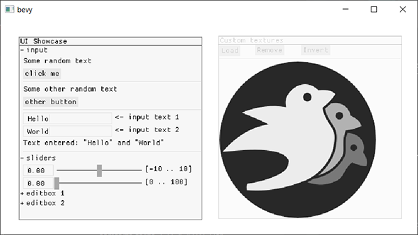

# `bevy_megaui`

[](https://crates.io/crates/bevy_megaui)
[](https://github.com/bevyengine/bevy/blob/master/LICENSE)
[](https://crates.io/crates/bevy_megaui)
[](https://github.com/mvlabat/bevy_megaui/actions)

This crate provides a [megaui](https://crates.io/crates/megaui) integration for the [Bevy](https://github.com/bevyengine/bevy) game engine.

`bevy_megaui` depends solely on `megaui` and `bevy` with only `render` feature required.



## Trying out

An example WASM project is live at [mvlabat.github.io/bevy_megaui_web_showcase](https://mvlabat.github.io/bevy_megaui_web_showcase/index.html) [[source](https://github.com/mvlabat/bevy_megaui_web_showcase)].

**Note** that in order to use `bevy_megaui`in WASM you need [bevy_webgl2](https://github.com/mrk-its/bevy_webgl2) of at least `0.4.1` version.

## Usage

Here's a minimal usage example:
```toml
# Cargo.toml
[dependencies]
bevy = "0.4"
bevy_megaui = "0.1"
```

```rust
use bevy::prelude::*;
use bevy_megaui::{
    megaui::{hash, Vector2},
    MegaUiContext, MegaUiPlugin,
};

fn main() {
    App::build()
        .add_plugins(DefaultPlugins)
        .add_plugin(MegaUiPlugin)
        .add_system(ui_example.system())
        .run();
}

fn ui_example(_world: &mut World, resources: &mut Resources) {
    let mut ui = resources.get_thread_local_mut::<MegaUiContext>().unwrap();

    ui.draw_window(
        hash!(),
        Vector2::new(5.0, 5.0),
        Vector2::new(100.0, 50.0),
        None,
        |ui| {
            ui.label(None, "Hello world!");
        },
    );
}
```

For a more advanced example, see [examples/ui.rs](examples/ui.rs).

```bash
cargo run --example ui --features="bevy/x11 bevy/png bevy/bevy_wgpu"
```
